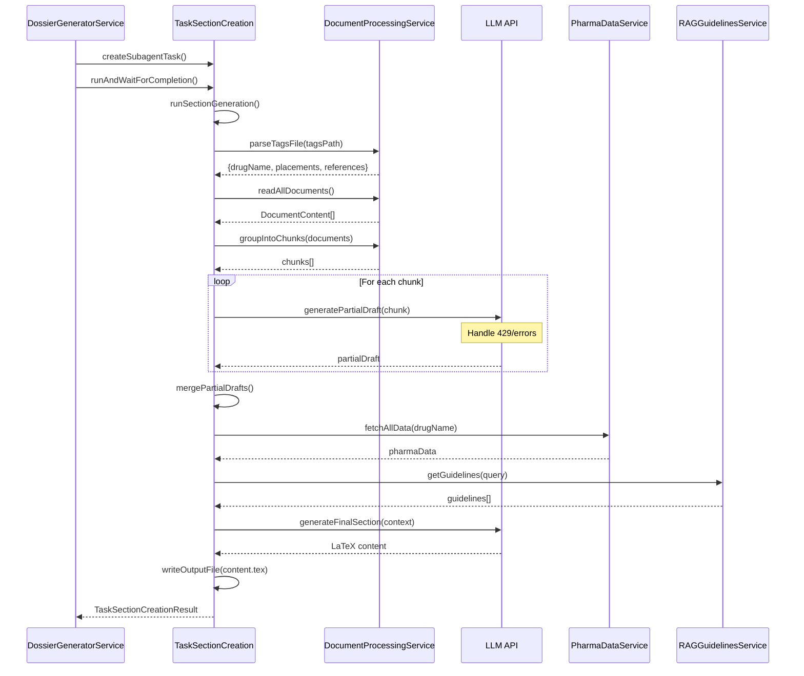

# TaskSectionCreation - Custom AI Agent for Dossier Section Generation

## Overview

`TaskSectionCreation` is a specialized AI agent that extends the base `Task` class to generate regulatory submission content for CTD (Common Technical Document) dossier sections. It implements a sophisticated multi-pass processing flow that handles large document contexts, integrates pharmaceutical data sources, and produces LaTeX-formatted regulatory content.

## Key Features

- **Chunked Document Processing**: Processes documents in chunks to manage LLM context window limits
- **Multi-Pass Generation**: Analyzes documents in chunks, then synthesizes into final output
- **Pharmaceutical Data Integration**: Fetches supplemental drug data via Function1-5 handlers
- **RAG Guidelines Integration**: Retrieves section-specific ICH writing guidelines
- **Robust Error Handling**: Handles rate limits (429), context window exceeded, and API failures
- **Progress Reporting**: Real-time status updates via callbacks and system notifications
- **Completion Detection**: Monitors both task state and output file existence

## Architecture

```
┌─────────────────────────────────────────────────────────────────────────┐
│                        TaskSectionCreation                               │
│                     (extends Task class)                                 │
├─────────────────────────────────────────────────────────────────────────┤
│                                                                          │
│  ┌──────────────────────┐  ┌──────────────────────┐                     │
│  │ DocumentProcessing   │  │   PharmaDataService  │                     │
│  │      Service         │  │                      │                     │
│  │                      │  │  - Drug Info         │                     │
│  │  - Parse tags.md     │  │  - Regulatory Info   │                     │
│  │  - Read .mmd files   │  │  - Clinical Data     │                     │
│  │  - Chunk documents   │  │  - Manufacturing     │                     │
│  │  - Token estimation  │  │  - Safety Data       │                     │
│  └──────────────────────┘  └──────────────────────┘                     │
│                                                                          │
│  ┌──────────────────────┐  ┌──────────────────────┐                     │
│  │  RAGGuidelinesService│  │  ErrorHandlerService │                     │
│  │                      │  │                      │                     │
│  │  - ICH guidelines    │  │  - Rate limit (429)  │                     │
│  │  - Section templates │  │  - Context exceeded  │                     │
│  │  - Writing tips      │  │  - Exponential backoff│                    │
│  └──────────────────────┘  └──────────────────────┘                     │
│                                                                          │
└─────────────────────────────────────────────────────────────────────────┘
```

## Processing Flow



## Files

### Core Files

| File | Description |
|------|-------------|
| `src/core/task/TaskSectionCreation.ts` | Main agent class extending Task with custom section generation flow |
| `src/services/pdf/DossierGeneratorService.ts` | Service that orchestrates subagent creation and execution |

### Service Files

| File | Description |
|------|-------------|
| `src/core/task/services/DocumentProcessingService.ts` | Parses tags.md, reads documents, chunks for context management |
| `src/core/task/services/PharmaDataService.ts` | Modular wrapper for Function1-5 pharma data handlers |
| `src/core/task/services/RAGGuidelinesService.ts` | Retrieves ICH writing guidelines (placeholder for RAG integration) |
| `src/core/task/services/ErrorHandlerService.ts` | Handles rate limits, context errors, retry logic |

### Supporting Files

| File | Description |
|------|-------------|
| `src/services/pdf/sample-tags.md` | Sample tags.md file format with drug name field |

## Tags.md Format

The agent expects a `tags.md` file in each section folder with the following format:

```markdown
# Section 3.2.P.2.1 - Document Tags

> Drug/API Information
Drug Name: Levofloxacin
API Name: Levofloxacin USP

> Documents for this section

## Placements

Documents that should be **stored** in this section:

- [Document.pdf](path/to/document/folder) (Confidence)

## References

Documents that are **referenced/used** in this section:

- [Document.pdf](path/to/document/folder) (Confidence)
```

**Note**: Document paths are relative to the workspace's `documents/` folder.

## Services Detail

### DocumentProcessingService

Handles all document-related operations:

```typescript
// Key methods
parseTagsFile(tagsPath: string): Promise<ParsedTagsFile>
readAllDocuments(parsedTags: ParsedTagsFile): Promise<DocumentContent[]>
groupIntoChunks(documents: DocumentContent[], maxTokens?: number): DocumentChunk[]
formatChunkForLLM(chunk: DocumentChunk): string
```

**Token Estimation**: Uses ~4 characters per token heuristic
**Default Chunk Size**: 60,000 tokens (50% of typical context window)

### PharmaDataService

Modular wrapper for pharmaceutical data functions:

```typescript
// Available functions
getDrugInfo(drugName: string)      // PubChem compound data
getRegulatoryInfo(drugName: string) // FDA/regulatory literature
getClinicalData(drugName: string)   // Clinical trial data
getManufacturingInfo(drugName: string) // GMP/manufacturing data
getSafetyData(drugName: string)     // Pharmacovigilance data

// Extensible design
registerFunction(func: IPharmaFunction): void
```

### RAGGuidelinesService

Retrieves section-specific writing guidelines:

```typescript
// Query structure
interface RAGGuidelinesQuery {
  sectionId: string
  sectionTitle: string
  drugName: string
  apiName?: string
}

// Returns ICH references, section templates, writing tips
getWritingGuidelines(query: RAGGuidelinesQuery): Promise<RAGGuidelinesResult>
```

**Note**: Currently returns placeholder ICH M4 guidelines. Ready for actual RAG index integration.

### ErrorHandlerService

Robust error handling with retry logic:

```typescript
// Error types handled
enum ErrorType {
  RateLimit,           // 429 errors
  ContextWindowExceeded, // Token limit errors
  ApiError,            // 5xx errors
  NetworkError,        // Connection issues
  Timeout              // Request timeouts
}

// Retry strategies
executeWithRetry<T>(fn, config): Promise<RetryResult<T>>
executeWithContextReduction<T>(fn, maxReductions): Promise<RetryResult<T>>
```

**Rate Limit Strategy**: Exponential backoff (2s, 4s, 8s, 16s, 32s) with max 60s
**Context Reduction**: Reduces context by 25% per attempt, max 3 reductions

## Configuration

### TaskSectionCreationParams

```typescript
interface TaskSectionCreationParams {
  // Base Task params
  controller: Controller
  mcpHub: McpHub
  cwd: string
  stateManager: StateManager
  taskId: string
  // ... other base params

  // Section-specific params
  sectionId: string           // e.g., "3.2.P.5"
  sectionTitle: string        // e.g., "Control of Drug Product"
  sectionFolderPath: string   // Full path to section folder
  expectedOutputFile: string  // Path to content.tex output
  tagsPath: string            // Path to tags.md file
  onProgress?: (sectionId: string, status: string) => void
}
```

## Output

The agent generates a complete, standalone LaTeX document:

```latex
\documentclass[11pt,a4paper]{article}
\usepackage[utf8]{inputenc}
\usepackage{booktabs}
\usepackage{longtable}
\usepackage{hyperref}
% ... other packages

\begin{document}

\title{CTD Section X.X.X: Section Title}
\author{Regulatory Affairs}
\date{\today}
\maketitle

\section{X.X.X: Section Title}
% Generated regulatory content based on source documents

\subsection{Document References}
% List of all source documents

\end{document}
```

## Debugging

The agent includes comprehensive logging:

### System Notifications

Visual notifications appear at key stages:
- Starting section generation
- Parsing tags.md
- Found drug name and document count
- Reading documents
- Processing chunks
- Fetching pharma data
- Generating final content
- Writing output file
- Completion/Error status

### Console Logs

Detailed logs with prefixes:
- `[TaskSectionCreation {sectionId}]` - Main agent logs
- `[DocumentProcessingService]` - Document parsing/reading logs
- `[DossierGenerator]` - Orchestration logs
- `[PharmaDataService]` - Drug data fetching logs
- `[ErrorHandlerService]` - Retry/error handling logs

## Usage Example

```typescript
// From DossierGeneratorService
const task = await this.createSubagentTask(
  sectionId,
  section,
  sectionFolderPath,
  tagsPath,
  controller,
  subagentPrompt,
  onProgress
);

const result = await task.runAndWaitForCompletion(subagentPrompt);
// result: { success: boolean, sectionId: string, error?: string }
```

## Circular Dependency Resolution

The `TaskSectionCreation` class is imported dynamically in `DossierGeneratorService` to avoid circular dependency:

```
task/index.ts → slash-commands → DossierGeneratorService → TaskSectionCreation → task/index.ts
```

Solution: Use `import type` for types and dynamic `import()` for the class:

```typescript
// Static type import (no runtime dependency)
import type { TaskSectionCreation } from "@/core/task/TaskSectionCreation"

// Dynamic import at runtime
const { TaskSectionCreation: TaskSectionCreationClass } =
  await import("@/core/task/TaskSectionCreation")
```

## Future Enhancements

1. **RAG Integration**: Replace placeholder guidelines with actual vector index queries
2. **Additional Function Handlers**: Add more pharma data sources (Function6+)
3. **Parallel Chunk Processing**: Process multiple chunks concurrently
4. **Caching**: Cache document content and pharma data between runs
5. **Resume Capability**: Resume interrupted generation from last successful step

## Related Files

- `src/core/task/index.ts` - Base Task class
- `src/core/task/tools/handlers/Function1Handler.ts` - Drug info handler
- `src/core/task/tools/handlers/Function2Handler.ts` - Regulatory info handler
- `src/core/task/tools/handlers/Function3Handler.ts` - Clinical data handler
- `src/core/task/tools/handlers/Function4Handler.ts` - Manufacturing info handler
- `src/core/task/tools/handlers/Function5Handler.ts` - Safety data handler
- `src/core/ctd/templates/eac-nmra/definition.ts` - CTD template definitions


